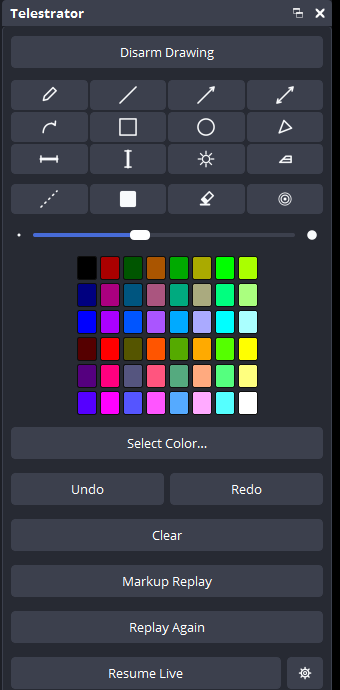
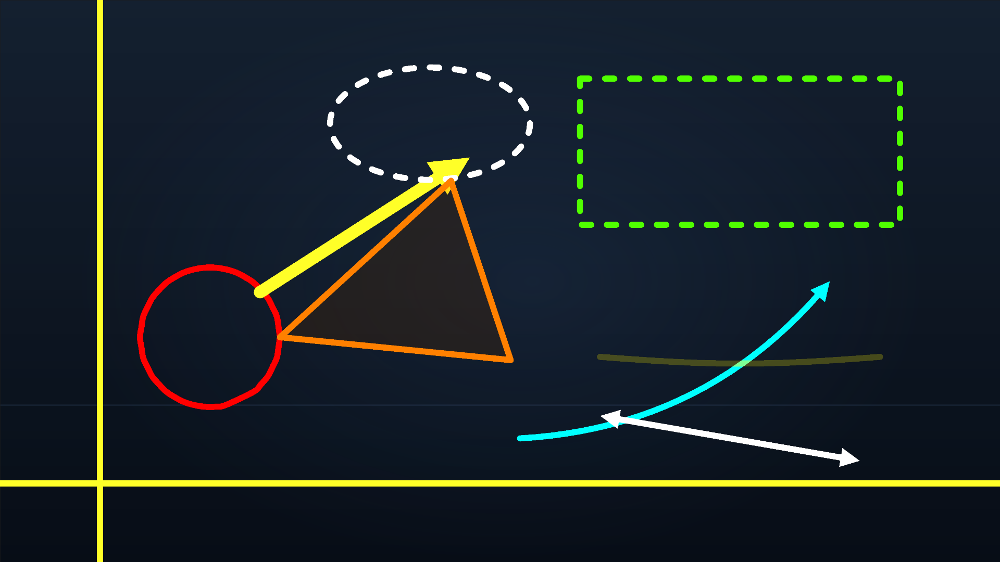

<div align="center">


# OBS Telestrator

**Broadcast-style telestration for [OBS Studio](https://obsproject.com).**
Draw arrows, shapes, and freehand ink straight onto your live output, and mark
up instant replays without ever leaving your scene.

</div>


## What it is

A native C++ plugin for [OBS Studio](https://obsproject.com) that adds a
**Telestrator** overlay source plus a set of docks that feel like part of OBS
itself. Think sports-broadcast analysis: circle a player, draw the play, cone
out the vision, then clear it and call the next one. Ink renders anti-aliased
with solid arrowheads and clean dashes, and composites into the program feed in
real time, so your stream and recording see exactly what you draw.

<p align="center">
  
  &nbsp;&nbsp;
  
</p>

## Install (Windows, OBS 31+)

1. Download `telestrator-x.y.z-windows-x64.zip` from
   [Releases](https://github.com/brendanwelsh/obs-telestrator/releases).
2. Close OBS and copy `telestrator.dll` into
   `C:\Program Files\obs-studio\obs-plugins\64bit\`.
3. Start OBS. The **Telestrator Tools / Color / Replay** docks and the
   **Telestrator Draw** pad appear automatically.

Or build from source (see below).

## Quick start

1. Click **Add to Current Scene** in the Telestrator Replay dock. That drops
   the overlay on top of the current scene (the same button removes it again).
2. Click **Arm Drawing**.
3. Pick a tool and a color, then draw in the **Telestrator Draw** pad: a live
   view of your program that maps ink pixel-exact onto the canvas.

Undo, redo, and clear are always one click (or one hotkey) away.

## Replay markup, built in

The plugin drives OBS's own **Replay Buffer** so you can do the classic
"let's look at that again" segment live:

1. Turn the replay buffer on once in OBS (Settings, Output, Replay Buffer),
   then click **Start Replay Buffer** in OBS's Controls dock.
2. When something happens, hit **Markup Replay**: the plugin saves the buffer
   and shows the clip in your scene with the telestrator raised on top of it.
3. Draw on the replay. **Replay Again** restarts the clip; play, pause, and
   restart are also available as hotkeys and controller buttons.
4. Hit **Resume Live** and you are back on the live feed. No scene switch,
   and your microphone audio is never interrupted.

## Tools and styles

| | |
|---|---|
| **Tools** | pen, line, arrow, double arrow, curved arrow, rectangle, ellipse, cone (translucent vision wedge), spotlight (dim everything except a region), horizontal guide line, vertical guide line, eraser |
| **Styles** | dashed, filled shapes, highlighter, opacity control, auto-fading laser pointer, auto-fade timer |
| **Color** | OBS's Select Color grid in the dock, plus a full color picker |
| **Edit** | undo, redo, clear, brush-size slider with thin/medium/thick presets |

Details worth knowing:

- The **curved arrow follows your drag**: sweep the cursor in an arc and the
  arrow bows that way, either direction, as deep as you swept.
- Ink is rendered supersampled (anti-aliased), arrowheads are solid filled
  triangles, dashes stay evenly spaced around corners and curves, and the
  highlighter lays down one uniform translucent layer instead of blotchy
  overlapping strokes.
- Everything is replay-safe: undo and redo rebuild the canvas exactly.

## The docks

Four docks, all in OBS's native theme, all state-synced: change a tool with a
hotkey or a Stream Deck and the docks update instantly.

- **Telestrator Tools**: the tool palette, style toggles, brush size, undo,
  redo, clear.
- **Telestrator Color**: the Select Color swatch grid; the active ink swatch
  is ringed.
- **Telestrator Replay**: arm/disarm, the replay markup flow, plugin settings,
  and scene management (add or remove the overlay on the current scene).
- **Telestrator Draw**: the drawing pad. A live program view with native Qt
  input; right-click it to choose **Fit to Window** or **Fill Window**. Drag
  it out to float it on its own monitor for a bigger surface.

Prefer drawing on a projector? Enable the legacy projector input in settings
(the gear in the Replay dock) and draw on a windowed projector instead.

## Hotkeys

Every command registers as an OBS hotkey under Settings, Hotkeys: tools,
colors, sizes, styles, arm/disarm, undo/redo/clear, laser, the replay
transport, and projector management. All of them use the stable
`telestrator.*` vocabulary listed in
[`docs/STREAMDECK-SPEC.md`](docs/STREAMDECK-SPEC.md).

## Settings

The gear button in the Telestrator Replay dock:

- auto-fade ink after N seconds
- armed indicator dot
- default ink opacity
- legacy projector / preview input (Windows cursor polling; off by default)

## Build from source

Based on the official
[obs-plugintemplate](https://github.com/obsproject/obs-plugintemplate).
Windows needs Visual Studio 2022 Build Tools (C++) and CMake:

```
cmake --preset windows-x64        # fetches libobs + Qt via buildspec.json
cmake --build --preset windows-x64
```

Output: `build_x64/rundir/RelWithDebInfo/telestrator.dll`, drop it into OBS's
`obs-plugins/64bit/`. Icons are embedded in the DLL; no extra files needed.
macOS and Linux presets exist but are untested so far; the input path is pure
Qt, so porting help is welcome.

## Hardware controllers

The telestrator speaks one command vocabulary, so a dock click, a hotkey, and a
hardware key are interchangeable. Every tool, color, size, style, edit action,
and the replay transport is a single press.

### Stream Deck

Map any `telestrator.*` command to a key over obs-websocket
(`TriggerHotkeyByName`), or lay out a full page like this one: tools, colors,
sizes, styles, edit, arm, projector, and the replay transport, with color keys
tinted to their ink. The command list and a suggested Stream Deck XL layout are
in [`docs/STREAMDECK-SPEC.md`](docs/STREAMDECK-SPEC.md).


### Ulanzi dial (planned)

A dedicated Ulanzi-dial plugin is on the [roadmap](docs/ROADMAP.md), not built
yet: rotate for brush size or replay scrub, press to arm, keys for tools and
colors. The design is specced in
[`docs/STREAMDECK-SPEC.md`](docs/STREAMDECK-SPEC.md). Until it ships, any
obs-websocket-capable dial can already fire the same hotkeys.

## Documentation

- [`CHANGELOG.md`](CHANGELOG.md): release history
- [`CONTRIBUTING.md`](CONTRIBUTING.md): building, style, and the compat contract
- [`docs/STREAMDECK-SPEC.md`](docs/STREAMDECK-SPEC.md): the full command list
- [`docs/CONTROLLERS.md`](docs/CONTROLLERS.md): controller integrations
- [`docs/PARITY.md`](docs/PARITY.md): parity with the original Lua engine
- [`docs/ROADMAP.md`](docs/ROADMAP.md): where this is going

## Lineage and attribution

A telestrator is the on-screen "draw on the video" tool popularized by sports
television. This project is a native C++ port of obs-telestrator-lua, itself
built on
[katarai/obs-whiteboard-lua](https://github.com/katarai/obs-whiteboard-lua), a
Lua port of [Herschel/obs-whiteboard](https://github.com/Herschel/obs-whiteboard)
by **Mike Welsh (mwelsh)** and **Tari**. It exists because of their original
whiteboard; that attribution rides along in the [`LICENSE`](LICENSE) and the
engine source header.

MIT licensed.

---

```
                    ^
                   / \
        __________/   \_______________
       /              o                \_____
       \                                     >==-
       \______________________________/____/
```

<div align="center"><sub>made by <b>chumthewaters</b> - go chum the waters 🦈</sub></div>
