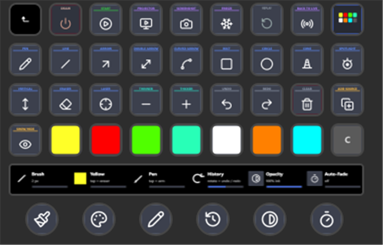

# Controllers — Stream Deck (today) and Ulanzi dial (planned)

The telestrator is built to be triggered live from hardware. Everything fires the
same `telestrator.*` command vocabulary (see
[`STREAMDECK-SPEC.md`](STREAMDECK-SPEC.md)), so a key, a dock button, and a hotkey
are interchangeable.

## Stream Deck (supported)

A Stream Deck XL page mapped to the telestrator: tools (rows 1-2), edit + sizes +
styles (row 3), colors (row 4), plus arm, projector, and the replay transport.
Each key fires one command over obs-websocket (`TriggerHotkeyByName`); color keys
are tinted to their ink, and arm and replay keys stand out.

Build it in the Stream Deck app key by key, then File -> Export Profile to share a
`.sdProfile`. The full command list is in [`STREAMDECK-SPEC.md`](STREAMDECK-SPEC.md).

## Ulanzi dial (planned)

A dedicated Ulanzi-dial plugin is specced but not built yet - see
[`ROADMAP.md`](ROADMAP.md). Intended encoder mode-cycle:
**SIZE > TOOL > COLOR > UNDO/REDO > REPLAY (scrub) > ZOOM**.

- Rotate adjusts the current mode. Press = arm/disarm - except **REPLAY** (press =
  play/pause) and **ZOOM** (press = reset to 1x).
- ZOOM drives a `SetSceneItemTransform` on a scene item named `Zoom` (a duplicate
  / Source Mirror of the scene): rotate scales 1-4x around center.
- Keys fire any single command (full vocabulary in the key property inspector).

Until it ships, any obs-websocket-capable dial can already fire the same hotkeys.
